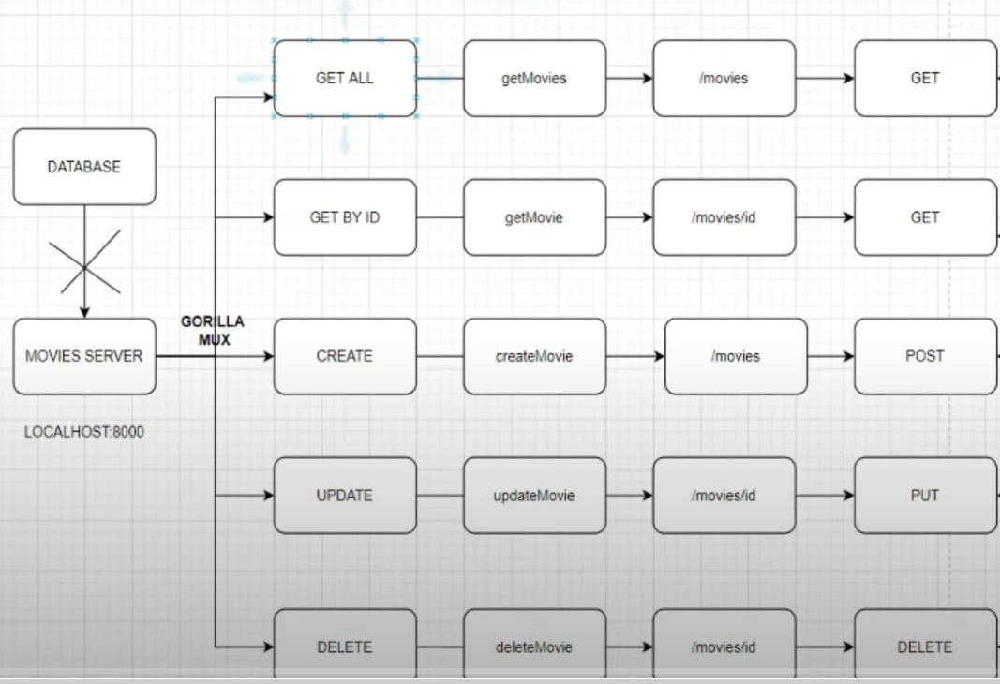

### CRUD API in GOLANG USING Gorilla Mux 

This POC Project makes use of gorilla mux library to handle routes for demonstating use of CRUD REST API .

NOTE: This project make use of go collections : Structs and Slices instead of DB to store data.

### HLD of Routing :

